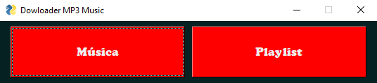
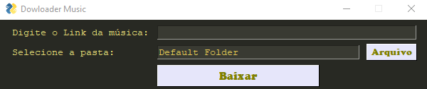
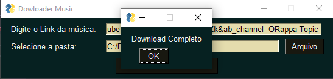

<h1> Fazer Download de Músicas, Playlists ou Vídeos diretos do Youtube </h1>

<h4 align='right'>Para visualizar o arquivo .py <a href='Downloader from Youtube.py'> Clique aqui. </a> </h4>

<h2>Sobre o projeto </h2>

&nbsp;&nbsp;&nbsp;&nbsp;   Acredito que algum de vocês já encontraram algo que está somente no youtube e gostou tanto, que pretende baixa-lo para poder ouvir ou assistir offline, porém procurando por sites para fazer download de músicas ou vídeos do youtube, nos deparamos com aqueles inúmeros anuncios e diversas etapas que precisam ser feitas para que a gente possa fazer um simples download. 

&nbsp;&nbsp;&nbsp;&nbsp;   Enquanto estava em meus estudos em python verifiquei que era possivel fazer o download de vídeos do youtube através do python, foi ai que me veio a ideia de fazer esse script para que eu possar fazer o download das músicas que gosto do youtube, sem precisar passar pelos diversos sites cheio de anuncios para baixa-la. 

&nbsp;&nbsp;&nbsp;&nbsp; Ao decorrer deste projeto irei apresentar o projeto que confeccionei para tornar possível este processo. 

<h2>Objetivo</h2>

&nbsp;&nbsp;&nbsp;&nbsp;   <b> O projeto tem como objetivo demonstrar a utilização do Python para realizar uma interface gráfica simples que realize o download de vídeos do Youtube e converta-os em arquivos.mp3, realizando resumidamente o processo de baixar músicas do youtube. Fazendo com que tenhamos ao final um software capaz de realizar downloads de playlist, músicas ou vídeos disponiveis no youtube.</b>

<h2>Conhecimentos Utilizados no Projeto </h3>
<h3> Python </h3>
<blockquote>
    <ul> 
    <li> Laços de Repetição. </li>
    <li> Estruturas de condição. </li> 
    <li> Funções. </li> 
    <li> Interface Gráfica com PySimpleGUI. </li>
    <li> Conversão de mp4 para mp3. </li>
    </ul> 
</blockquote>

<h2>Bibliotecas Utilizadas. </h2>
<blockquote>
    
</blockquote>

<h2> Imagens do funcionamento do programa. </h2>
    
 Imagem da Tela Inicial. 
     
    
    

    
 Imagem download de música. 
     
    
    

    
 Imagem Notificação de concluído. 
     
    
    

<h2> Sobre mim </h2>  
    <ul> 
    <li> 🎓 Estudante de <b>Engenharia de Software 3° Périodo - <a href='https://uniao.uniguacu.edu.br/'>Uniguaçu. </a></b></li>
    <li> 💻 Entusiasta por Python.   </li> 
    </ul> 
<h2> Contato </h3>
<blockquote>    
    <ul> 
    <li> <a href="https://www.linkedin.com/in/thanaelbutewicz/"> <b>Linkedin</b> </a> </li>
    <li> <a href="https://github.com/zThanael"> <b>GitHub</b> </a> </li>
    </ul> 
</blockquote>