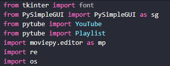
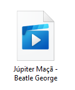
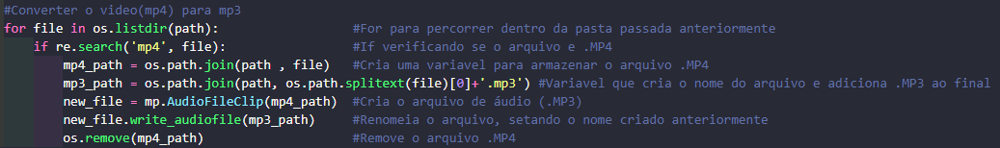
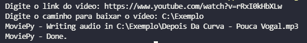
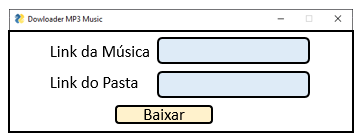

<h1> Fazer Download de músicas através do Python </h1>

<h4 align='right'>Para visualizar o arquivo .py <a href='Mp3_Dowloader.py'> Clique aqui </a> </h4>

<h2>Sobre o projeto </h2>

 Acredito que algum de vocês já encontraram uma música que está somente no youtube e gostou tanto dela que pretende baixa-la para poder ouvir offline, porém procurando por sites para fazer download de músicas, nos deparamos com aqueles inumeros anuncios e diversas etapas que precisam ser feitas para que a gente possa fazer um simples download. 

  Enquanto estava em meus estudos em python verifiquei que era possivel fazer o download de vídeos do youtube atraves do python, foi ai que me veio a ideia de fazer esse script para que eu possar fazer o download das músicas que gosto do youtube, sem precisar passar pelos diversos sites cheio de anuncios para baixa-la  
Ao decorrer deste projeto irei demonstrar com prints e explicações como funciona exatamente o código. 

<h2>Objetivo</h2>

 <b> O projeto tem como objetivo demonstrar a utilização do Python para realizar uma interface gráfica simples que realize o download de vídeos do Youtube e converte-los em arquivos.mp3, realizando resumidamente o processo de baixar músicas do youtube</b>

<h2>Bibliotecas Utilizadas </h2>
<blockquote>
    
</blockquote>

<h2> Explicação do Projeto </h2>

<h3><li>  Fazer Download do Vídeo do YouTube  </li></h3>

    Como a ideia do projeto é criar um script python que faça o download de uma musica do youtube precisamos primeiramente importar a biblioteca que faça essa etapa.  

<code> from pytube import YouTube </code>

<i>Obs: Na primeira vez que formos utilizar uma biblioteca diferente, é necessario fazer a instalação da mesma, para isso é apenas necessário abrir o terminal e digitar:</i>
    <code> pip install pytube </code>
  
   
  Agora só precisamos fazer o download da musica que queremos, para fazer o download pelo python vamos utilizar os seguintes comandos:  

 onde <b>Youtube(link)</b> é para conectar ao vídeo, sendo link a url do youtube, exemplo: <i> link = 'https://www.youtube.com/exemplo'.</i>
 
    
 E é na variavel <code>ys</code> que vamos realizar o download, onde passamos <b>.filter(only_audio=True)</b> para especificar que desejamos baixar somente o áudio, mesmo o arquivo baixado sendo <i>.mp4</i>.   Finalizando o código passamos <b>.download(path)</b> que consiste no caminho onde o vídeo será baixado, sendo <b> path </b> uma variavel que armazena a url do arquivo, exemplo: <i> path = 'C:\Exemplo'. </i> Se passarmos os links tanto do vídeo quanto do caminho e executarmos esse trecho, receberemos o seguinte  resultado: 

    
 Percebam que o arquivo esta em formato de vídeo, caso executem o vídeo, ele terá a tela preta e estará apenas
reproduzindo o áudio da música. 

<h3><li>  Converter o arquivo MP4 para MP3  </li></h3>
 
 Com o arquivo ja baixado, precisamos agora converte-lo de <b>.MP4 </b> para <b> .MP3 </b>, para isso vamos utilizar as bibliotecas <b> os , re </b> e <b>moviepy.editor </b> Lembrando que antes de usar o <i>moviepy.editor </i> teremos de fazer o download da biblioteca primeiro utilizando o comando <code> pip install moviepy </code> no terminal. Feito o dowload da biblioteca usaremos o seguinte trecho de codigo: 

    

 Feito esta estapa e a anterior ja temos um programa 100% funcional, que realize o dowload de um video do YouTube é converta o video para .MP3, ou seja possuimos um programa que realize o download de músicas disponiveis no YouTube. 

<h3><li>  Criando uma interface gráfica  </li></h3>

&nbsp;&nbsp;&nbsp;&nbsp; Agora que ja possuímos o programa funcionando, podemos fazer uma interface gráfica simples para ficar mais intuitivo de como utilizar o programa, ja que sem a interface gráfica possuimos apenas o codigo atraves do terminal, tendo esta saida. 

    

&nbsp;&nbsp;&nbsp;&nbsp; Com o objetivo de criar uma interface gráfica para o nosso programa, vamos utilizar a biblioteca <b> PySimpleGUI </b> para criar a interface, mas antes precisamos fazer o download da mesma, utilizando o seguinte comando <code> pip install PySimpleGUI </code>.  

&nbsp;&nbsp;&nbsp;&nbsp;Antes de criarmos a nossa interface precisamos fazer um esboço, pode ser feito até mesmo em um papel, de como queremos que seja a interface, para que tenhamos um modelo de como o programa deverá ser. 

 Um exemplo de esboço: 

